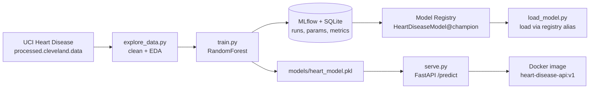
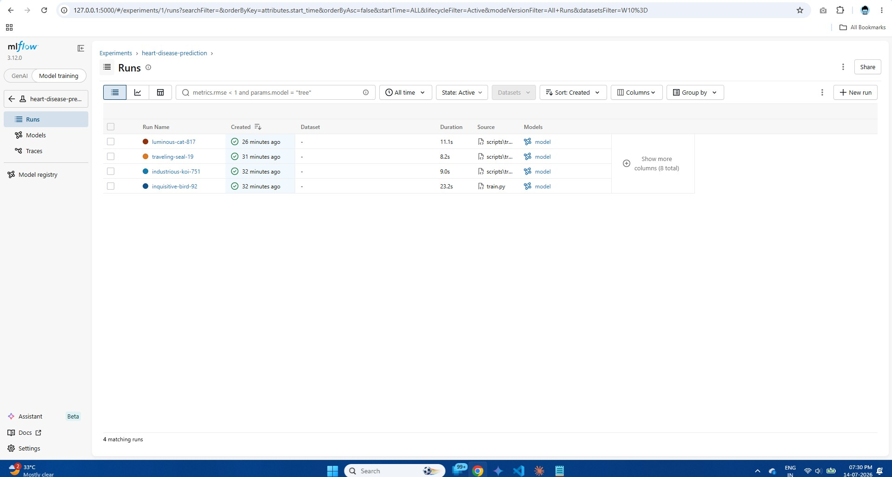
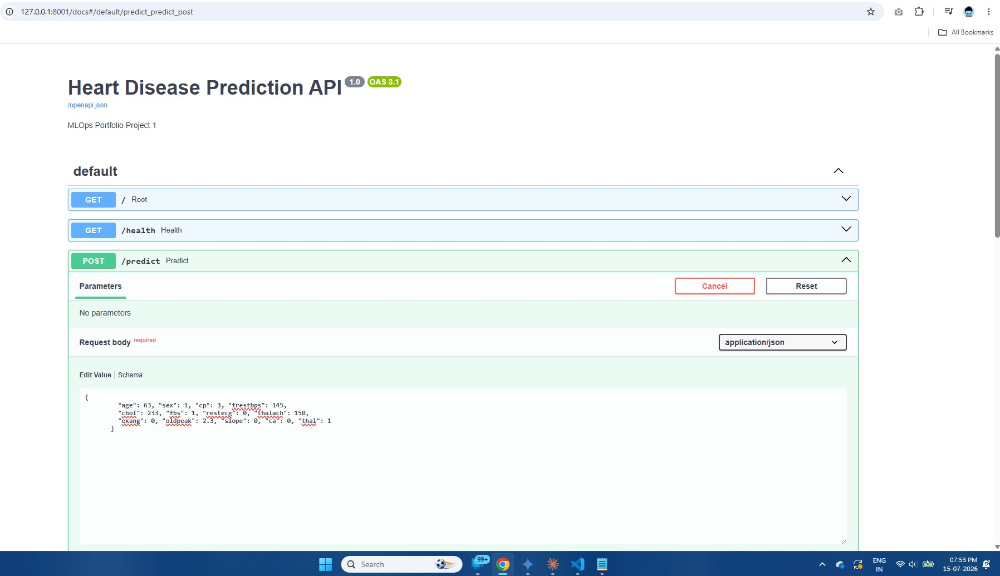

# Heart Disease Prediction — MLOps Portfolio Project 1


An **end-to-end MLOps pipeline** built on a clinical dataset — the full journey from raw data to a **served, containerised** machine-learning model. Built locally on an 8 GB Windows laptop; Docker step run in GitHub Codespaces.

> This README doubles as my personal **interview / demo reference**: each pipeline stage lists its *key topics* and the *mandatory learning* to internalise before moving on. See [The MLOps Journey](#the-mlops-journey--key-topics--mandatory-learnings).

---

## What This Project Demonstrates

- **Data ingestion & cleaning** with pandas (missing-value handling, binary target encoding)
- **Model training** with scikit-learn (Random Forest Classifier)
- **Experiment tracking & model registry** with MLflow (SQLite backend, model *aliases*)
- **Real-time model serving** via a FastAPI REST API (auto-generated Swagger docs)
- **Containerisation** with Docker (slim image, decoupled from the tracking server)
- **Reproducibility & MLOps hygiene** (artifacts out of git, train↔serve consistency)

---

## Architecture



The pipeline has **two model-loading paths on purpose**: `load_model.py` loads from the **MLflow registry** (the governed, versioned path), while the **Docker container** loads a plain **pickle** (small, self-contained, no tracking server needed).

---

## Tech Stack

| Layer | Tool | Version |
|---|---|---|
| Language | Python | 3.14 local / 3.11-slim in Docker |
| Data | pandas | latest |
| Modelling | scikit-learn (RandomForest) | 1.8 |
| Tracking + Registry | MLflow (SQLite backend) | 3.12 |
| API | FastAPI + Uvicorn | 0.136 / 0.47 |
| Validation | Pydantic v2 | 2.13 |
| Packaging | Docker | — |

---

## Dataset

**UCI Heart Disease Dataset** (Cleveland) — 303 patient records, 13 clinical features, target = presence of heart disease.

- Original target is 0–4 (severity) → collapsed to **binary** (0 = no disease, 1 = disease).
- 6 rows contain `?` (missing `ca` / `thal`) → dropped → **297 clean rows**.
- Download: <https://archive.ics.uci.edu/dataset/45/heart+disease> (file: `processed.cleveland.data`).

---

## Results

| Metric | Value |
|---|---|
| Model | Random Forest (`n_estimators=200`, `max_depth=10`) |
| Accuracy | **88.33 %** |
| F1 Score | **0.857** |
| Registered as | `HeartDiseaseModel` v3, alias `@champion` |



---

## Project Structure

```
mlops-heart-disease-pipeline/
├── data/                    # datasets (gitignored — download UCI data here)
├── models/
│   └── heart_model.pkl      # trained model (tracked, so Docker build works from a clone)
├── scripts/
│   ├── explore_data.py      # data loading, cleaning & EDA
│   ├── train.py             # training + MLflow logging (SQLite) + pkl dump
│   ├── load_model.py        # load model from the registry via @champion alias
│   └── serve.py             # FastAPI serving endpoint (loads the pkl)
├── screenshots/             # evidence of the working system
├── Dockerfile               # container definition
├── requirements.txt         # serving dependencies (slim, for the image)
└── README.md
```

> **Note on `requirements.txt`:** it is deliberately slim (serving deps only — no MLflow) so the Docker image stays small. To run **training / registry** locally, also install MLflow: `pip install mlflow`.

---

## Setup & How to Run

> Run everything from the repo root so relative paths (`data/…`, `models/…`, `sqlite:///mlflow.db`) resolve.

### 0. Install & get the data
```bash
pip install -r requirements.txt   # serving deps
pip install mlflow                # needed for training + registry
# download processed.cleveland.data into ./data/
python scripts/explore_data.py    # -> creates data/heart_clean.csv
```

### 1. Train the model
```bash
python scripts/train.py           # logs to MLflow (SQLite) AND writes models/heart_model.pkl
```

### 2. View experiments in the MLflow UI
```bash
python -m mlflow ui --backend-store-uri sqlite:///mlflow.db
# open http://127.0.0.1:5000
```
> `python -m mlflow` (not bare `mlflow`) because pip's per-user Scripts folder isn't on PATH.
> `--backend-store-uri` is **required** — without it the UI reads the empty default store and looks blank.

### 3. Register the best run & promote it (MLflow 3.x uses aliases, not stages)
Register `HeartDiseaseModel` in the UI, then set the `champion` alias:
```python
from mlflow import MlflowClient
MlflowClient().set_registered_model_alias("HeartDiseaseModel", "champion", "3")
```

### 4. Load the model back from the registry
```bash
python scripts/load_model.py      # loads models:/HeartDiseaseModel@champion, prints a prediction
```

### 5. Serve the API (local)
```bash
python scripts/serve.py           # http://127.0.0.1:8001/docs
```

### 6. Run in Docker
```bash
docker build -t heart-disease-api:v1 .
docker run -p 8000:8000 heart-disease-api:v1
# open http://127.0.0.1:8000/docs
```


---

## API Usage

**`POST /predict`** — request body:
```json
{
  "age": 63, "sex": 1, "cp": 3, "trestbps": 145,
  "chol": 233, "fbs": 1, "restecg": 0, "thalach": 150,
  "exang": 0, "oldpeak": 2.3, "slope": 0, "ca": 0, "thal": 1
}
```
Response:
```json
{
  "prediction": 0,
  "result": "No Disease",
  "confidence": 0.2394
}
```
Other endpoints: **`GET /`** (root/health message) and **`GET /health`** (status probe).



---

## The MLOps Journey — Key Topics & Mandatory Learnings

The reference table. Each stage lists its **key topics** and the **one thing you must understand before moving on**.

| # | Stage | Key Topics | Mandatory Learning (before next step) |
|---|-------|-----------|----------------------------------------|
| 1 | **Environment Setup** | Python, `pip`, per-user installs, PATH | Per-user pip installs put CLIs (e.g. `mlflow.exe`) **outside PATH** → run tools as `python -m <tool>`. Confirm versions early. |
| 2 | **Data Loading & EDA** | pandas, `na_values`, missing data, target encoding | Always check `shape` + nulls before modelling. Encode the multiclass target (0–4) → **binary** (0/1). Drop/impute missing rows deliberately (303 → 297). |
| 3 | **Model Training** | train/test split, RandomForest, accuracy vs F1 | **Split before training** for an honest test score. Set `random_state` for **reproducibility**. Track F1, not just accuracy, when classes can be imbalanced. |
| 4 | **Experiment Tracking** | MLflow experiments, runs, params/metrics, backends | The default **file store (`./mlruns`) is deprecated in MLflow 3.x** — use a DB backend (`sqlite:///mlflow.db`). The UI must be pointed at it via `--backend-store-uri`. Tracking = objective run comparison. |
| 5 | **Model Registry** | registration, versions, **aliases** | **MLflow 3.x removed stages** (Production/Staging) → use **aliases** (`@champion`). Registry needs a DB backend. Version URI (`/3`) pins a version; an alias is a **movable "which model is live" pointer**. |
| 6 | **Serving (FastAPI)** | REST, Pydantic v2, Swagger `/docs` | Pydantic **v2 uses `.model_dump()`**, not `.dict()`. **Load the model once at startup**, not per request. FastAPI auto-generates interactive `/docs` from your schema. |
| 7 | **Containerisation** | Dockerfile, layers, slim images, decoupling | A container has **only what `requirements.txt` installs** — it surfaces hidden "works on my machine" deps. **Decouple serving from the tracking server** (load a pkl, not the registry) to keep the image small & standalone. |
| 8 | **Documentation & Publish** | README as portfolio, reproducibility | Data/model artifacts are gitignored by default → **document how to regenerate them** (clone → train → build). The README is the interface between your work and a hiring manager. |
| ★ | **Cross-cutting: Train↔Serve consistency** | model drift | The **served artifact must be regenerated on every retrain** — a stale pkl silently serves an old model while your registry shows the new one. |

---

## Pitfalls I Hit & How I Fixed Them

Real problems from building this — each is a good "tell me about a bug you debugged" story.

1. **`PermissionError` loading the CSV.** The dataset zip had extracted into a *folder* named `processed.cleveland.data`; `open()` on a directory raises `PermissionError` on Windows (`IsADirectoryError` on Linux). **Fix:** point the loader at the actual file.
2. **MLflow runs "disappeared."** Runs were logged to a **SQLite** backend but I was inspecting the default **file store** — and the file store is deprecated/limited in MLflow 3.x. **Fix:** standardise on `sqlite:///mlflow.db` in code, and launch the UI with `--backend-store-uri`.
3. **`models:/HeartDiseaseModel/Production` wouldn't resolve.** MLflow 3.x **removed stages**. **Fix:** use an **alias** — `models:/HeartDiseaseModel@champion`.
4. **`.dict()` deprecated.** Pydantic v2. **Fix:** `.model_dump()`.
5. **The API served a 3-week-old model.** A refactor moved training to MLflow logging and silently **dropped the `pickle.dump`**, so `serve.py` kept loading a stale pkl. **Fix:** `train.py` now writes both the MLflow model and the pkl — a concrete case of **train/serve drift**.
6. **Container crashed: `ModuleNotFoundError: No module named 'mlflow'`.** `serve.py` still `import`ed mlflow, but it had been removed from the slim `requirements.txt`. It never failed locally (mlflow was installed globally). **Fix:** remove the dead imports — the textbook **"works on my machine"** lesson that containers exist to catch.

---

## Interview One-Liners

- *"I built an end-to-end MLOps pipeline: ingestion → training → MLflow tracking & registry → FastAPI serving → Docker containerisation."*
- *"I promote models with registry **aliases** (champion/challenger), since MLflow 3 deprecated stages."*
- *"I **decouple serving from the tracking server** by baking a model artifact into the image — small, dependency-light, and independently deployable."*
- *"I prevent **model drift** by regenerating the served artifact on every retrain, so training and serving never diverge."*

---

## Author

**Srinivas Charan Mamidi**
LinkedIn: [linkedin.com/in/srinivascharanmamidi](https://linkedin.com/in/srinivascharanmamidi)
